# Documentazione

Questo documento fornisce una breve documentazione riguardante l'applicazione *CoronaBBS*.
L'applicazione è stata realizzata dal gruppo di lavoro **Corona-Extra** composto da:

- [Michele Stelluti](https://github.com/MicheleStelluti)
- [Vincenzo Susso](https://github.com/VincenzoSusso)
- [Giuseppe Tanzi](https://github.com/Giuseppe-Tanzi)

## Indice

1. [Introduzione](#1-Introduzione)
2. [Requisiti](#2-Requisiti)
    1. [Requisiti Funzionali](#21-Requisiti-Funzionali)
    2. [Requisiti Non Funzionali](#22-Requisiti-Non-Funzionali)
3. [Divisione In Package e Classi Implementate](#3-Divisione-In-Package-e-Classi-Implementate)
4. [Scelte Progettuali](#4-Scelte-Progettuali)
    1. [Architettura Client/Server](#41-Architettura-Client/Server)
    2. [Database](#42-Database)
    3. [GameDescription e NextMove()](#43-GameDescription-e-NextMove())
5. [Manuale Utente](#5-Manuale-Utente)
    1. [Introduzione](#51-Introduzione)
    2. [Login](#52-Login)
    3. [Registrazione](#53-Registrazione)
    4. [Scelta Del Gioco](#54-Scelta-Del-Gioco)
    5. [Schermata Di Gioco](#55-Schermata-Di-Gioco)

## 1. Introduzione

L'applicazione CoronaBBS si basa su un modello di sistema BBS (Bulletin Board System). Esso consente di iniziare una partita ad uno dei due giochi:

- Prison Break;
- Fire House.

Entrambi sono giochi d'avventura testuali giocabili tramite interfaccia grafica basata su Java e avviabile su terminali Windows, Linux e Mac OS.
L'applicazione utilizza un'architettura client/server.
Per poter giocare ad uno dei due giochi, è obbligatorio registrarsi e effettuare, successivamente, il login. Dopodichè, il sistema offre la possibilità di iniziare una nuova partita o caricarne una già salvata sul database memorizzato sul server.
Il server contiene un database, il quale memorizza le credenziali di ogni utente e le partite salvate di ognuno dei giochi disponibili, associate ad ogni utente.
Ogni client ha la possibilità di memorizzare una partita per gioco disponibile: se è già presente una partita salvata, il sistema mostra un messaggio di errore, il quale avvisa che la partita già salvata potrà essere sovrascritta dalla partita attuale.
L'applicazione è estendibile attraverso l'inserimento di nuovi giochi da offrire all'utente.

## 2. Requisiti

### 2.1 Requisiti Funzionali

ID     | TITOLO | DESCRIZIONE
:----: | :-----: |  -------
`RF1`  | Registrarsi |  L'utente deve essere in grado di registrarsi inserendo username, password, data di nascita e residenza
`RF2`  | Accedere  |  L'utente deve essere in grado di accedere al sistema inserendo username e password corretti
`RF3`  | Avviare un gioco disponibile | L'utente deve essere in grado di scegliere uno tra i giochi disponibili sul server e avviarlo
`RF4`  | Caricare una partita già esistente | L'utente deve essere in grado di caricare una partita già esistente nel database
`RF5`  | Salvare una partita |  L'utente deve essere in grado, in qualunque punto della partita, di salvare una partita quando desidera chiudere il gioco
`RF6`  | Sovrascrivere una partita già esistente | L'utente deve essere in grado di sovrascrivere una partita già esistente sul database
`RF8`  | Aprire l'inventario | L'utente deve essere in grado di guardare quali oggetti sono presenti nell'inventario
`RF9`  | Muoversi a nord di una stanza | L'utente deve essere in grado di muoversi a nord di una stanza, se essa non è bloccata
`RF9`  | Muoversi a sud di una stanza |  L'utente deve essere in grado di muoversi a sud di una stanza, se essa non è bloccata
`RF10` | Muoversi ad est di una stanza | L'utente deve essere in grado di muoversi ad est di una stanza, se essa non è bloccata
`RF11` | Muoversi ad ovest di una stanza | L'utente deve essere in grado di muoversi ad ovest di una stanza, se essa non è bloccata
`RF12` | Uscire dal gioco | L'utente deve essere in grado di uscire dalla partita chiudendo la finestra del client
`RF13` | Guardare una stanza | L'utente deve essere in grado di guardare la descrizione di una stanza e vedere quali oggetti ci sono
`RF14` | Scrivere nella barra di input una frase di comando | L'utente deve essere in grado, in qualunque punto della partita, scrivere una frase, la quale possa portare ad un'azione del protagonista nel corso della partita
`RF15` | Conoscere il proprio score | L'utente deve essere in grado di conoscere il proprio score durante il corso della partita attraverso un riquadro in alto a destra della schermata o tramite il comando `guarda punteggio` nel corso della partita

### 2.2 Requisiti Non Funzionali

|  ID     | REQUISITO        | DESCRIZIONE                                                  |
| :---:   | ---------------- | :----------------------------------------------------------- |
| `RNF1`  | Affidabilità | Il sistema è capace di evitare che si verificano errori, malfunzionamenti o che siano prodotti risultati non corretti o inattesi. |
| `RNF2`  | Compatibilità | È necessario essere in possesso di una macchina con uno dei seguenti SO: Windows, Mac OS, distribuzioni Linux |
| `RNF3`  | Efficienza | Il sistema richiede un quantitativo basso di risorse |
| `RNF4`  | Eseguibilità | Per eseguire l'applicazione è necessario disporre di una Java Virtual Machine 8 (o superiore) |
| `RNF5`  | Operabilità | L'applicazione non richiede l'installazione sulla macchina. Si presenta come eseguibile in formato `Jar` e la propria esecuzione avviene tramite interfaccia grafica |
| `RNF6`  | Estendibilità | L'applicazione è predisposta a poter accettare qualsiasi cambiamento o di aggiunta di nuove features |
| `RNF7`  | Interoperabilità | Il sistema non è autonomo. Esso prevede interazione con il server |
| `RNF8`  | Manutentabilità | L'applicazione è facilmente manutentabile grazie alla modularità delle componenti, ai principi dell'Information Hiding applicati, la medio-alta coesione introdotta e la presentazione separata delle componenti
| `RNF9`  | Modularità | L'applicazione fa uso del concetto di modularità che aiuta a ridurre la complessità del problema e ne facilità l'estendibilità |
| `RNF10` | Riusabilità | Alcuni componenti dell'applicazione potrebbero essere riutilizzati per realizzare giochi simili |
| `RNF11` | Scalabilità | Il programma prevede l'esecuzione da parte di più utenti contemporaneamente |
| `RNF12` | Sicurezza | Il sistema gestisce informazioni riservate e le memorizza in maniera cryptata, in un database |
| `RNF13` | Robustezza | Il programma è capace di gestire le situazioni in cui si manifestano errori o eccezioni dovuti a mosse e/o comandi non validi |
| `RNF14` | Utilizzo | |

### 3 Divisione In Package e Classi Implementate

Per una corretta modulazione del sistema sono stati creati diversi package:

- Il package *client* contiene l'intera interfaccia grafica e le classi inerenti al client. Sono state create diverse classi swing per la comunicazione con l'utente. Tra queste ci sono:

  - ClientMainClass, la quale si occupa di avviare la comunicazione con il server e l'interfaccia grafica del client;
  - GameView e ManagageGameView, le quali si occupano della gestione dell'interfaccia con l'utente riguardante i comandi dell'avventura testuale durante il gioco;
  - Login e ManageLogin, le quali si occupano della gestione dell'interfaccia con l'utente riguardante il login iniziale per accedere ad uno dei giochi presenti nel database presente sul server;
  - SignUp e ManageSignUp, le quali si occupano della gestione dell'interfaccia con l'utente riguardante la registrazione sul database, memorizzato sul server, necessaria al successivo login;
  - GameChooserView e ManageGameChooser, le quali si occupano della gestione dell'interfaccia con l'utente riguardante la scelta del gioco da avviare tra quelli presenti nel database.

- Il package *exceptions* contiene le varie eccezioni che potrebbero essere chiamate durante il gioco, tra cui:
  - InputExceptions, le quali sono eccezioni chiamate con la comparsa di errori di tipo lessicali, sintattici o di altro tipo riguardante l'input inviato dall'utente;
  - InventoryExceptions, le quali sono eccezioni chiamate con la comparsa di errori legati all'accesso all'inventario in game;
  - ObjectExceptions, le quali sono eccezioni chiamate con la comparsa di errori legati alla ricerca di oggetti da parte del client;
  - RoomExceptions, le quali sono eccezioni chiamate con la comparsa di errori legati al movimento del personaggio nelle varie stanze del gioco inacessibili all'utente.

- Il package *server* contiene:
  - una classe *ServerMainClass*, la quale si occupa della creazione del database e delle 3 tabelle utili alla memorizzazione delle credenziali utente e delle partite. Inoltre per ogni client connesso al server, essa crea un nuovo thread che si occuperà della gestione con esso;
  - una classe *RequestThread*, la quale si occupa della comunicazione con il client;
  - il package *games*, il quale contiene, a sua volta, i due giochi al momento disponibili:
    - il package *prisonBreak* contiene l'inizializzazione delle stanze, degli oggetti e dei comandi disponibili. Inoltre contiene un package *movement* il quale gestisce il movimento del personaggio nel gioco con le relative conseguenze dei comandi inseriti, tra cui la risoluzione di enigmi, blocco/sblocco delle stanze, presa degli oggetti e relativa aggiunta all'inventario, ecc...;
    - il package *parser* contiene le diverse classi utili alla verifica lessicale e sintattica dell'input inserito dall'utente e la consequenziale verifica semantica. La lingua utilizzata da entrambi i giochi è dipendente dalla lingua italiana, ma il parser è estendibile ad altre lingue.
    - il package *type* contiene le diverse entità riscontrabili nel gioco, tra cui l'inventario, le stanze, gli oggetti, oggetti contenitori, comandi e aggettivi.

- Il package *utils* contiene classi utili all'intero sistema. Una tra queste è la classe *Password*, la quale contiene un metodo per l'operazione di *hash* della password e un metodo per il check della password inserita dall'utente con quella memorizzata in database. Entrambi i metodi fanno uso della libreria esterna *Bcrypt*.

## 4 Scelte progettuali

### 4.1 Architettura Client/Server

Abbiamo deciso di sviluppare la nostra applicazione con architettura Client/Server in modo da mettere a disposizione il servizio CoronaBBS su rete, nel nostro caso, il Server ha la responsabilità della logica di gestione dei dati (i dati sono salvati su un database) e della logica applicativa, infatti è il server che gestisce le varie operazioni che il client vuole fare. Il client ha la responsabilità della logica di presentazione; infatti il client nel nostro sistema ha il compito di mostrare le diverse finestre e inviare messaggi al server per la gestione delle risposte.

Abbiamo deciso di dividere in questo modo le responsabilità tra Client e Server in quanto la gestione dei messaggi non richiede molta banda. Inoltre il Client può essere eseguito anche su computer datati in quanto non ha responsabilità sulla logica applicativa.

### 4.2 Database

Abbiamo deciso di utilizzare il database in modo da non essere legati agli svantaggi dei file tra cui:

- I dati sono organizzati in insiemi indipendenti (le relazioni fra i dati non sono rappresentate);
- Gli operatori disponibili sui file dipendono dal tipo di archivio (sequenziale, relativo, associativo);
- Per effettuare semplici operazioni sui dati è necessario scrivere programmi.
- La struttura logica di un archivio deve essere dichiarata in tutti i programmi che ne fanno uso.

### 4.3 GameDescription e nextMove()

Abbiamo deciso di utilizzare la classe GameDescription in modo da rendere tutti i giochi simili, infatti tutti i giochi devono implementare il metodo *nextMove()* che prende in input una tripla Verbo - Oggetto - Aggettivo e in base a questo capisce che operazione dovrà fare, il metodo *nextMove()* restituisce una stringa relativa al comando, è stato fatto questo in modo da rendere il *nextMove()* indipendente dal Client su cui verrà mostrato il messaggio.

## 5 Manuale Utente

### 5.1 Introduzione

Il gioco è basata su architettura *Client*/*Server*, quindi per poter usufruire dei giochi presenti sulla nostra piattaforma, sarà necessario avviare due eseguibili.

Innanzitutto è necessario avviare l'eseguibile della parte Server (ServerMainClass), dopodiché dovrà essere avviato l'eseguibile della parte Client (ClientMainClass).

In questo manuale utente ci soffermeremo sulla parte client in quanto è quella che dovrà essere messa a disposizione dell'utente.

### 5.2 Login

Appena avviato il client, se riuscirà a connettersi al server, uscirà la prima schermata, ovvero quella dedicata al login

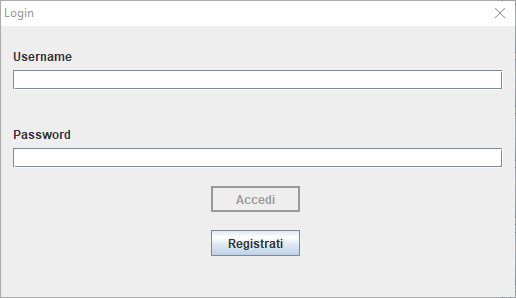

La schermata di Login mette a disposizione due campi di testo in cui sarà necessario scrivere il proprio username e la propria password.

Se si inserisce un username che non esiste si avrà la seguente schermata di errore

Se il nome utente è corretto e la password è errata, si ha la seguente schermata di errore

Il pulsante `Accedi` sarà inizialmente disabilitato e sarà attivato solo quando l'utente avrà inserito almeno un carattere nei campi *Username* e *Password*;
se l'username e la password saranno corretti spunterà la seguente schermata che avviserà l'utente di aver eseguito l'accesso correttamente

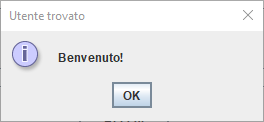

L'utente potrà anche premere la `X`, in questo caso il client mostrerà una schermata chiedendo all'utente se è sicuro di voler uscire, se la risposta è positiva il client si chiuderà altrimenti ritornerà nella schermata di login

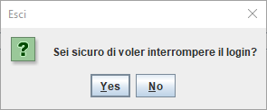

In alternativa l'utente potrà cliccare sul bottone `Registrati` che aprirà una nuova schermata.

### 5.3 Registrazione

Se l'utente non ha ancora un profilo, sarà possibile registrarsi cliccando sul tasto `Registrati` presente nella schermata di Login.

La schermata presenta diversi campi in cui sarà possibile inserire: il nome utente (deve essere univoco) e deve contenere almeno un carattere; la password, la quale deve essere compresa tra 6 e 8 caratteri deve contenere almeno un numero, un carattere minuscolo e uno maiuscolo; la data di nascita e la residenza. La schermata di registrazione è la seguente:

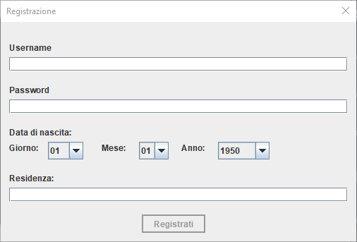

Il tasto `registrati` è disabilitato fino a che non si inserisce almeno un carattere nei campi *Username*, *Password* e *Residenza*

Nella schermata dedicata alla registrazione possono esserci diversi errori: se la data indicata non è corretta, il client mostrerà il seguente messaggio di errore

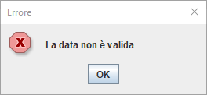

Se l'utente inserisce un username che è già stato preso, allora il client mostrerà la seguente finestra:

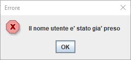

Anche in questo caso l'utente potrà premere la `X` che mostrerà una finestra per confermare l'uscita dalla registrazione, in caso positivo verrà mostrata di nuovo la schermata di Login

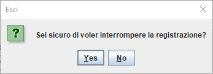

Infine, se l'iscrizione è stata effettuata con successo, il client mostrerà la seguente schermata:

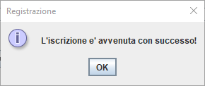

### 5.4 Scelta Del Gioco

Dopo aver fatto correttamente il login, il client mostrerà una finestra contenente un campo per poter scegliere il gioco da voler eseguire e due bottoni che servono rispettivamente per iniziare una nuova partita o caricare una partita già esistente.

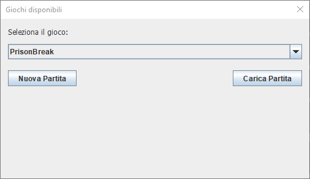

Se nel server non è presente nessun salvataggio del gioco selezionato e si clicca sul bottone `Nuova Partita`, allora il gioco mostrerà la seguente schermata di conferma e farà partire il gioco

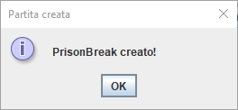

Se nel server è presente un gioco e si clicca sul bottone `Nuova partita`, allora il client mostrerà una finestra che chiederà all'utente se inserire vuole comunque iniziare una nuova partita o no

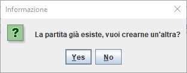

Se è stata già salvata è possibile caricare la partita utilizzando il bottone `Carica`. Se la partita viene caricata correttamente, il client mostrerà la seguente schermata:

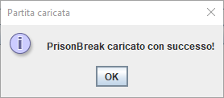

Se il server non ha nessun salvataggio e l'utente clicca `Carica`, allora il client mostrerà il seguente messaggio

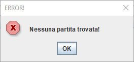

Se l'utente clicca sulla `X` in questa schermata uscirà una schermata di conferma, se la risposta è positiva, allora il client terminerà l'esecuzione

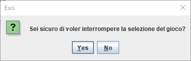

### 5.5 Schermata Di Gioco

La schermata di gioco presenta diversi componenti. Infatti è presente un'area di testo in cui è solo possibile leggere dedicata alle risposte del gioco, un'area di testo in cui è possibile inserire i comandi, un'area di testo solo leggibile nel quale è presente il punteggio della partita e infine sono presenti alcuni pulsanti per i comandi più usati nel gioco

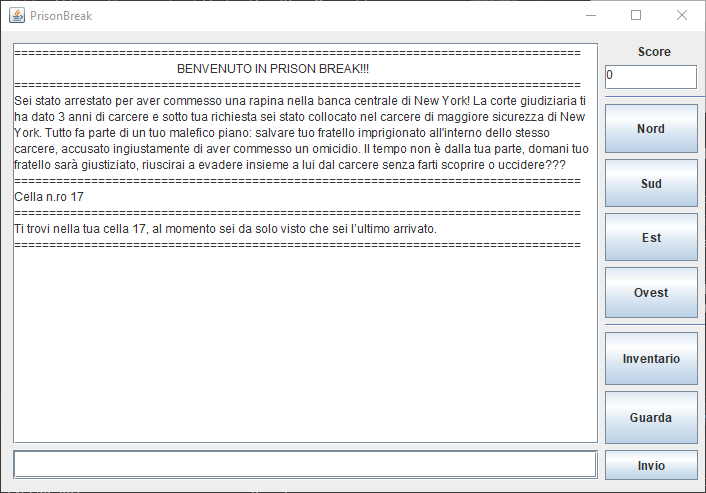

Se si clicca la `X` della finestra, il gioco chiederà all'utente conferma per poter uscire

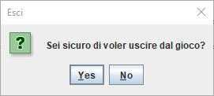

Infine se la scelta di uscire dal gioco è positiva, il client mostrerà una schermata che chiederà all'utente se vuole salvare la partita in corso o no

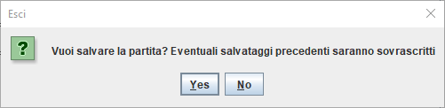
