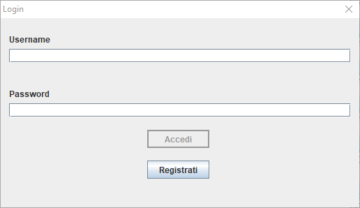
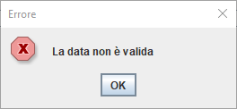
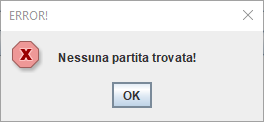
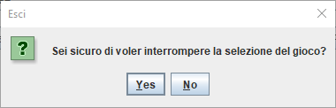
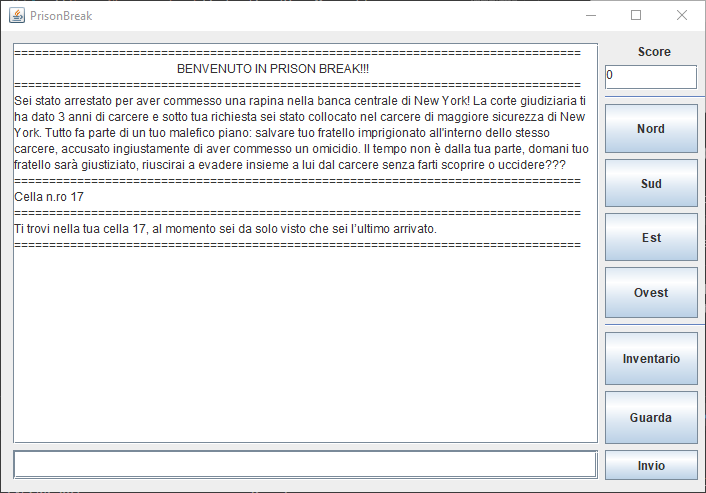
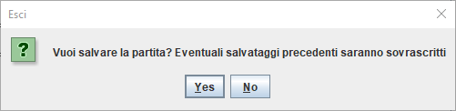

# Manuale Utente

## Indice

1. [Introduzione](#1-Introduzione)
2. [Login](#2-Login)
3. [Registrazione](#3-Registrazione)
4. [Scelta Del Gioco](#4-Scelta-Del-Gioco)
5. [Schermata Di Gioco](#5-Schermata-Di-Gioco)

## 1 Introduzione

Il gioco è basata su architettura *Client*/*Server*, quindi per poter usufruire dei giochi presenti sulla nostra piattaforma, sarà necessario avviare due eseguibili.

Innanzitutto è necessario avviare l'eseguibile della parte Server (ServerMainClass), dopodiché dovrà essere avviato l'eseguibile della parte Client (ClientMainClass).

In questo manuale utente ci soffermeremo sulla parte client in quanto è quella che dovrà essere messa a disposizione dell'utente.

## 2 Login

Appena avviato il client, se riuscirà a connettersi al server, uscirà la prima schermata, ovvero quella dedicata al login

La schermata di Login mette a disposizione due campi di testo in cui sarà necessario scrivere il proprio username e la propria password.

Se si inserisce un username che non esiste si avrà la seguente schermata di errore

Se il nome utente è corretto e la password è errata, si ha la seguente schermata di errore

Il pulsante `Accedi` sarà inizialmente disabilitato e sarà attivato solo quando l'utente avrà inserito almeno un carattere nei campi *Username* e *Password*;
se l'username e la password saranno corretti spunterà la seguente schermata che avviserà l'utente di aver eseguito l'accesso correttamente

L'utente potrà anche premere la `X`, in questo caso il client mostrerà una schermata chiedendo all'utente se è sicuro di voler uscire, se la risposta è positiva il client si chiuderà altrimenti ritornerà nella schermata di login

In alternativa l'utente potrà cliccare sul bottone `Registrati` che aprirà una nuova schermata.

## 3 Registrazione

Se l'utente non ha ancora un profilo, sarà possibile registrarsi cliccando sul tasto `Registrati` presente nella schermata di Login.

La schermata presenta diversi campi in cui sarà possibile inserire: il nome utente (deve essere univoco) e deve contenere almeno un carattere; la password, la quale deve essere compresa tra 6 e 8 caratteri deve contenere almeno un numero, un carattere minuscolo e uno maiuscolo; la data di nascita e la residenza. La schermata di registrazione è la seguente:

Il tasto `registrati` è disabilitato fino a che non si inserisce almeno un carattere nei campi *Username*, *Password* e *Residenza*

Nella schermata dedicata alla registrazione possono esserci diversi errori: se la data indicata non è corretta, il client mostrerà il seguente messaggio di errore

Se l'utente inserisce un username che è già stato preso, allora il client mostrerà la seguente finestra:

Anche in questo caso l'utente potrà premere la `X` che mostrerà una finestra per confermare l'uscita dalla registrazione, in caso positivo verrà mostrata di nuovo la schermata di Login

Infine, se l'iscrizione è stata effettuata con successo, il client mostrerà la seguente schermata:

## 4 Scelta Del Gioco

Dopo aver fatto correttamente il login, il client mostrerà una finestra contenente un campo per poter scegliere il gioco da voler eseguire e due bottoni che servono rispettivamente per iniziare una nuova partita o caricare una partita già esistente.

Se nel server non è presente nessun salvataggio del gioco selezionato e si clicca sul bottone `Nuova Partita`, allora il gioco mostrerà la seguente schermata di conferma e farà partire il gioco

Se nel server è presente un gioco e si clicca sul bottone `Nuova partita`, allora il client mostrerà una finestra che chiederà all'utente se inserire vuole comunque iniziare una nuova partita o no

Se è stata già salvata è possibile caricare la partita utilizzando il bottone `Carica`. Se la partita viene caricata correttamente, il client mostrerà la seguente schermata:

Se il server non ha nessun salvataggio e l'utente clicca `Carica`, allora il client mostrerà il seguente messaggio

Se l'utente clicca sulla `X` in questa schermata uscirà una schermata di conferma, se la risposta è positiva, allora il client terminerà l'esecuzione

## 5 Schermata Di Gioco

La schermata di gioco presenta diversi componenti. Infatti è presente un'area di testo in cui è solo possibile leggere dedicata alle risposte del gioco, un'area di testo in cui è possibile inserire i comandi, un'area di testo solo leggibile nel quale è presente il punteggio della partita e infine sono presenti alcuni pulsanti per i comandi più usati nel gioco

Se si clicca la `X` della finestra, il gioco chiederà all'utente conferma per poter uscire

Infine se la scelta di uscire dal gioco è positiva, il client mostrerà una schermata che chiederà all'utente se vuole salvare la partita in corso o no

