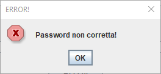

# Manuale Utente

## Introduzione
Il gioco è basata su architettura *Client*/*Server*, quindi per poter usufruire dei giochi presenti sulla nostra piattaforma, sarà necessario avviare due eseguibili. 

Innanzitutto è necessario avviare l'eseguibile della parte Server (ServerMainClass), dopodiché dovrà essere avviato l'eseguibile della parte Client (ClientMainClass).

In questo manuale utente ci soffermeremo sulla parte client in quanto è quella che dovrà essere messa a disposizione dell'utente.

## Login

Appena avviato il client, se riuscirà a connettersi al server uscirà la prima schermata, ovvero quella dedicata al login

La schermata di Login mette a disposizione due campi di testo in cui sarà necessario scrivere il proprio username e la propria password, se si inserisce un username che non esiste si avrà la seguente schermata di errore

Se il nome utente è corretto e la password è errata, si avrà la seguente schermata di errore

Il pulsante "Accedi" è inizialmente disabilitato e sarà attivato solo quando l'utente avrà inserito almeno un carattere nei campi "Username" e "Password",
se l'username e la password sono corretti spunterà sarà possibile accedere alla schermata dedicata alla
scelta del gioco da seguire, in alternativa l'utente potrà cliccare sul bottone "Registrati" che permetterà di creare un nuovo utente.

